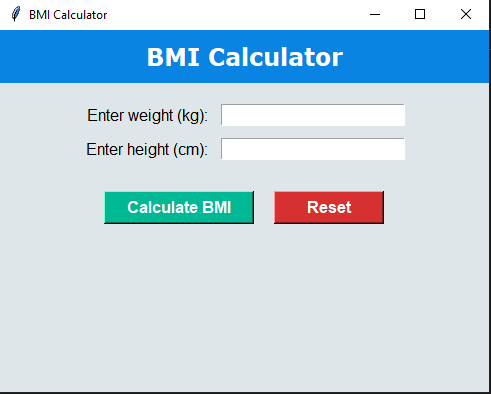

# BMI Calculator (Python + Tkinter)

A desktop GUI app to compute Body Mass Index from weight and height.

## Features
- Modernized UI (custom colors, fonts, layout)
- BMI categories with health suggestions
- Reset button to clear inputs
- Auto-saves results to `bmi_records.txt`

## How to Run
```bash
python bmi_calculator.py'
```
**Here you can see how it looks **


Future Scope

BMI scale visualization with matplotlib

User history view

Installer build with pyinstaller
